# Laporan Modul 2 OPREC NETICS

| **Nama**                | **NRP**    |
| ----------------------- | ---------- |
| Gilbran Mahdavikia Raja | 5025241134 |

---

## Daftar Isi

1. [Informasi Deployment](#-informasi-deployment)
2. [Arsitektur & Flow Diagram](#-arsitektur--flow-diagram)
3. [Instalasi Wazuh Manager](#-instalasi-wazuh-manager)
4. [Instalasi Wazuh Agent](#-instalasi-wazuh-agent)
5. [Validasi Koneksi Agent–Manager](#-validasi-koneksi-agentmanager)
6. [Custom Rules](#-custom-rules)
7. [Hasil Dashboard & Alert](#-hasil-dashboard--alert)

---

## Informasi Deployment

| Komponen          | Detail                                      |
| ----------------- | ------------------------------------------- |
| **Wazuh Manager** | Microsoft Azure VM                          |
| **IP Address**    | `20.239.28.7`                               |
| **Domain**        | `netics-modul2.eastasia.cloudapp.azure.com` |
| **OS Manager**    | Ubuntu 24.04 LTS                            |
| **Wazuh Agent**   | Local Machine - CachyOS (Arch-based Linux)  |
| **Versi Wazuh**   | 4.x                                         |

---

## Arsitektur & Flow Diagram

```
  ┌───────────────────────────────────────────────────────────────────┐
  │                       DEPLOYMENT TOPOLOGY                         │
  └───────────────────────────────────────────────────────────────────┘

  ┌──────────────────────────────┐         ┌──────────────────────────┐
  │       LOCAL MACHINE          │         │     MICROSOFT AZURE VM   │
  │       (Wazuh Agent)          │         │     (Wazuh Manager)      │
  │                              │         │                          │
  │  OS: CachyOS (Arch-based)    │         │  OS: Ubuntu 24.04 LTS    │
  │  Wazuh Agent v4.x            │         │  IP: 20.239.28.7         │
  │                              │  HTTPS  │  Domain:                 │
  │  Monitors:                   │◄───────►│  netics-modul2.eastasia  │
  │  - /var/log/auth.log         │  :1514  │  .cloudapp.azure.com     │
  │  - /var/log/syslog           │  (TCP)  │                          │
  │  - auditd events             │         │  Components:             │
  │  - USB device events         │         │  - wazuh-manager         │
  │  - FIM (~/dotfiles)          │         │  - wazuh-indexer         │
  │                              │         │  - wazuh-dashboard       │
  └──────────────────────────────┘         └──────────────────────────┘
                                                        │
                                                        │ HTTPS :443
                                                        ▼
                                           ┌──────────────────────────┐
                                           │ WAZUH DASHBOARD (Web UI) │
                                           │                          │
                                           │  Akses via browser:      │
                                           │  https://20.239.28.7     │
                                           └──────────────────────────┘

  DATA FLOW:
  Agent ──[collect logs/events]──► Agent Buffer
        ──[encrypted TCP :1514]──► Manager (Analysisd)
        ──[rule matching]────────► Alert Generation
        ──[stored in indexer]────► Dashboard Visualization
```

---

## Instalasi Wazuh Manager

Instalasi dilakukan pada Azure VM dengan OS Ubuntu 24.04 LTS menggunakan metode **All-in-One Deployment** (Manager + Indexer + Dashboard dalam satu node).

### Prasyarat

```bash
# Update sistem
sudo apt-get update && sudo apt-get upgrade -y
```

### Langkah 1 - Install Wazuh Manager, Indexer, dan Dashboard

```bash
curl -sO https://packages.wazuh.com/4.14/wazuh-install.sh && sudo bash ./wazuh-install.sh -a
```

### Langkah 2 - Verifikasi Layanan

```bash
sudo systemctl status wazuh-manager
sudo systemctl status wazuh-indexer
sudo systemctl status wazuh-dashboard
```

> **Catatan:** Setelah instalasi, credential admin default akan ditampilkan di terminal. Simpan baik-baik untuk login ke dashboard.

### Langkah 3 - Konfigurasi Azure NSG (Firewall)

Buka port berikut di Azure Network Security Group:

| Port   | Protocol | Fungsi              |
| ------ | -------- | ------------------- |
| `443`  | HTTPS    | Dashboard Web UI    |
| `1514` | TCP      | Agent communication |
| `1515` | TCP      | Agent enrollment    |

---

## Instalasi Wazuh Agent

Instalasi dilakukan pada mesin lokal yang menjalankan **CachyOS** (distribusi berbasis Arch Linux).

### Langkah 1 - Install Wazuh Agent menggunakan Pacman

Karena CachyOS berbasis Arch Linux, instalasi dengan script one-liner tidak didukung secara penuh. Wazuh Agent diinstall secara manual melalui package manager (AUR helper).

```bash
# Menginstall wazuh-agent menggunakan AUR helper (misal yay)
yay -S wazuh-agent
```

### Langkah 2 - Enrollment Agent secara Manual

Setelah instalasi selesai, lakukan enrollment agent ke Wazuh Manager secara manual menggunakan tool `agent-auth`:

```bash
sudo /var/ossec/bin/agent-auth -m 20.239.28.7
```

### Langkah 3 - Konfigurasi Agent

Edit file `/var/ossec/etc/ossec.conf`:

```xml
<ossec_config>
  <client>
    <server>
      <address>20.239.28.7</address>
      <port>1514</port>
      <protocol>tcp</protocol>
    </server>
    <notify_time>10</notify_time>
    <time-reconnect>60</time-reconnect>
    <auto_restart>yes</auto_restart>
  </client>

  <!-- File Integrity Monitoring -->
  <syscheck>
    <disabled>no</disabled>
    <frequency>300</frequency>
    <directories realtime="yes" check_all="yes">/home/mamahda/dotfiles</directories>
  </syscheck>

  <!-- Audit untuk kamera dan mikrofon -->
  <localfile>
    <log_format>audit</log_format>
    <location>/var/log/audit/audit.log</location>
  </localfile>

  <!-- Mengumpulkan log dari systemd journald -->
  <localfile>
    <log_format>journald</log_format>
    <location>journald</location>
  </localfile>
</ossec_config>

```

### Langkah 4 - Konfigurasi Auditd untuk Kamera & Mikrofon

```bash
# Tambahkan audit rules untuk monitoring kamera dan mikrofon
sudo bash -c 'cat >> /etc/audit/rules.d/custom.rules << EOF
# Monitor camera access
-a always,exit -F arch=b64 -S openat -F path=/dev/video0 -F key=camera

# Monitor microphone access
-a always,exit -F arch=b64 -S openat -F dir=/dev/snd/ -F key=mic
EOF'

# Reload audit rules
sudo augenrules --load
sudo systemctl restart auditd
```

### Langkah 5 - Jalankan Agent

```bash
sudo systemctl daemon-reload
sudo systemctl enable wazuh-agent
sudo systemctl start wazuh-agent
```

---

## Validasi Koneksi Agent–Manager

### Dari Sisi Manager - Cek Status Agent

```bash
# Cek daftar agent yang terdaftar
sudo /var/ossec/bin/agent_control -l

# Output yang diharapkan:
# ID: <agent_id>, Name: <agent_name>, IP: <agent_ip>, Status: Active
```

### Dari Sisi Agent - Cek Log Koneksi

```bash
sudo tail -f /var/ossec/logs/ossec.log | grep -i "connected\|error"

# Output yang diharapkan:
# wazuh-agentd: INFO: Connected to the server (192.168.x.x:1514).
```

### Melalui Dashboard Wazuh

Buka browser dan akses `https://20.239.28.7`:

1. Login dengan credential admin
2. Navigasi ke **Agents** → **Summary**
3. Pastikan agent `<agent_name>` berstatus **Active**

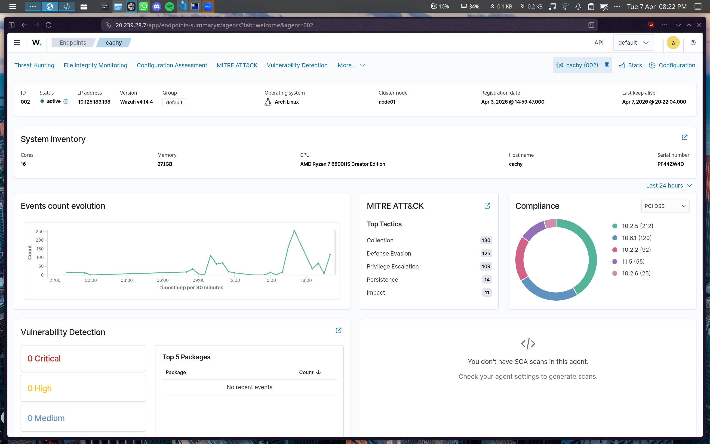

> _Screenshot: Agent CachyOS berhasil terhubung ke Wazuh Manager di Azure_

---

## Custom Rules

Semua custom rules disimpan dalam file `/var/ossec/etc/rules/local_rules.xml` pada Wazuh Manager.

```xml
<group name="netics_custom_rules">
  <!-- Rules 1-10 (lihat penjelasan di bawah) -->
</group>
```

### Cara Menambahkan Custom Rules

```bash
# Buat file rules baru di manager
sudo nano /var/ossec/etc/rules/local_rules.xml

# Paste seluruh isi rules, kemudian validasi
sudo /var/ossec/bin/wazuh-logtest

# Restart manager untuk menerapkan rules
sudo systemctl restart wazuh-manager
```

---

### Rule 1 - Privilege Escalation: Sudo Session as Root

```xml
<rule id="100010" level="10">
  <if_sid>5501</if_sid>
  <program_name>sudo</program_name>
  <match>session opened for user root</match>
  <description>Privilege Escalation: Sudo session opened as root user</description>
  <mitre>
    <id>T1548.003</id>
  </mitre>
</rule>
```

**Penjelasan:**

| Atribut          | Detail                                                                                                                                         |
| ---------------- | ---------------------------------------------------------------------------------------------------------------------------------------------- |
| **Rule ID**      | `100010`                                                                                                                                       |
| **Level**        | `10` (High)                                                                                                                                    |
| **Parent SID**   | `5501` - PAM session events                                                                                                                    |
| **Trigger**      | Log `sudo` mengandung `session opened for user root`                                                                                           |
| **MITRE ATT&CK** | [T1548.003](https://attack.mitre.org/techniques/T1548/003/) - Abuse Elevation Control Mechanism: Sudo and Sudo Caching                         |
| **Tujuan**       | Mendeteksi setiap kali ada user yang membuka sesi sudo sebagai root. Ini adalah indikator awal privilege escalation yang harus dipantau ketat. |

**Contoh log trigger:**

```
Dec 10 10:23:45 hostname sudo: pam_unix(sudo:session): session opened for user root by mamahda(uid=1000)
```

---

### Rule 2 - Privilege Escalation Ignored: Trusted Admin (mamahda)

```xml
<rule id="100011" level="5">
  <if_sid>100010</if_sid>
  <match>by mamahda</match>
  <description>Privilege Escalation (Ignored): Trusted admin sudo session (mamahda)</description>
</rule>
```

**Penjelasan:**

| Atribut        | Detail                                                                                                                                                                                                                     |
| -------------- | -------------------------------------------------------------------------------------------------------------------------------------------------------------------------------------------------------------------------- |
| **Rule ID**    | `100011`                                                                                                                                                                                                                   |
| **Level**      | `5` (Medium - diturunkan dari level 10)                                                                                                                                                                                    |
| **Parent SID** | `100010` - Rule privilege escalation di atas                                                                                                                                                                               |
| **Trigger**    | Jika sudo session tersebut dilakukan oleh user `mamahda`                                                                                                                                                                   |
| **Tujuan**     | **Whitelisting / noise reduction.** User `mamahda` adalah trusted admin yang sering menggunakan sudo. Rule ini menurunkan severity alert agar tidak membanjiri SOC analyst dengan false positive dari aksi admin yang sah. |

> Rule ini bersifat **override child rule** - hanya aktif jika rule parent (100010) terpicu terlebih dahulu.

---

### Rule 3 - Authentication Failure: Multiple Failed Passwords

```xml
<rule id="100020" level="6" frequency="2" timeframe="60">
  <if_sid>5557</if_sid>
  <match>password check failed</match>
  <description>Authentication Failure: Multiple failed password attempts detected</description>
  <mitre>
    <id>T1110</id>
  </mitre>
</rule>
```

**Penjelasan:**

| Atribut          | Detail                                                                                                                                             |
| ---------------- | -------------------------------------------------------------------------------------------------------------------------------------------------- |
| **Rule ID**      | `100020`                                                                                                                                           |
| **Level**        | `6` (Medium)                                                                                                                                       |
| **Parent SID**   | `5557` - PAM authentication failure                                                                                                                |
| **Frequency**    | `2` kali dalam `60` detik                                                                                                                          |
| **MITRE ATT&CK** | [T1110](https://attack.mitre.org/techniques/T1110/) - Brute Force                                                                                  |
| **Tujuan**       | Mendeteksi percobaan brute force atau password guessing. Alert terpicu jika ada **2 atau lebih** kegagalan autentikasi dalam rentang **60 detik**. |

**Contoh log trigger:**

```
Dec 10 10:30:01 hostname sudo: pam_unix(sudo:auth): authentication failure; user=mamahda
Dec 10 10:30:05 hostname sudo: pam_unix(sudo:auth): authentication failure; user=mamahda
```

---

### Rule 4 - Device Connection: Gamepad Connected (Allowed Hours)

```xml
<rule id="100030" level="3">
  <if_sid>81101</if_sid>
  <match>New USB device found, idVendor=3537, idProduct=2106,</match>
  <description>Device Connection: Gamepad connected (allowed hours)</description>
</rule>
```

**Penjelasan:**

| Atribut        | Detail                                                                                                                                                                                                             |
| -------------- | ------------------------------------------------------------------------------------------------------------------------------------------------------------------------------------------------------------------ |
| **Rule ID**    | `100030`                                                                                                                                                                                                           |
| **Level**      | `3` (Low - informatif)                                                                                                                                                                                             |
| **Parent SID** | `81101` - USB device kernel events                                                                                                                                                                                 |
| **Trigger**    | USB device dengan Vendor ID `3537` dan Product ID `2106` (gamepad spesifik) terhubung                                                                                                                              |
| **Tujuan**     | Menjadi **base rule** untuk deteksi gamepad. Rule ini aktif sebagai filter device spesifik sebelum diteruskan ke rule time-based di bawahnya. Di luar jam kerja, hanya menghasilkan alert informatif level rendah. |

---

### Rule 5 - Policy Violation: Gamepad Connected During Work Hours

```xml
<rule id="100031" level="15">
  <if_sid>100030</if_sid>
  <time>01:00-08:00</time>
  <description>Policy Violation: Gamepad connected during restricted hours</description>
  <mitre>
    <id>T1200</id>
  </mitre>
</rule>
```

**Penjelasan:**

| Atribut          | Detail                                                                                                                                                                                                                                                                     |
| ---------------- | -------------------------------------------------------------------------------------------------------------------------------------------------------------------------------------------------------------------------------------------------------------------------- |
| **Rule ID**      | `100031`                                                                                                                                                                                                                                                                   |
| **Level**        | `15` (Critical - level tertinggi)                                                                                                                                                                                                                                          |
| **Parent SID**   | `100030` - Rule deteksi gamepad di atas                                                                                                                                                                                                                                    |
| **Time Window**  | `01:00 – 08:00 UTC` (= **08:00 – 15:00 WIB / UTC+7**)                                                                                                                                                                                                                      |
| **MITRE ATT&CK** | [T1200](https://attack.mitre.org/techniques/T1200/) - Hardware Additions                                                                                                                                                                                                   |
| **Tujuan**       | Mendeteksi **pelanggaran kebijakan penggunaan perangkat** selama jam kerja. Jika gamepad terhubung antara jam 08.00–15.00 WIB, ini dianggap pelanggaran serius (misalnya karyawan bermain game saat jam kerja). Level 15 memastikan alert ini langsung mendapat perhatian. |

> **Catatan Timezone:** Wazuh menggunakan UTC. Jam kerja 08:00–15:00 WIB (UTC+7) setara dengan 01:00–08:00 UTC.

---

### Rule 6 - Privacy Monitoring: Camera Access Detected

```xml
<rule id="100040" level="12">
  <if_sid>80700</if_sid>
  <field name="audit.key">camera</field>
  <description>Privacy Monitoring: Camera access detected</description>
  <mitre>
    <id>T1125</id>
  </mitre>
</rule>
```

**Penjelasan:**

| Atribut          | Detail                                                                                                                                                                                                          |
| ---------------- | --------------------------------------------------------------------------------------------------------------------------------------------------------------------------------------------------------------- |
| **Rule ID**      | `100040`                                                                                                                                                                                                        |
| **Level**        | `12` (High)                                                                                                                                                                                                     |
| **Parent SID**   | `80700` - Auditd syscall events                                                                                                                                                                                 |
| **Trigger**      | Event auditd dengan key `camera` (dipicu oleh audit rule pada `/dev/video*`)                                                                                                                                    |
| **MITRE ATT&CK** | [T1125](https://attack.mitre.org/techniques/T1125/) - Video Capture                                                                                                                                             |
| **Tujuan**       | Mendeteksi **akses tidak terduga ke kamera** perangkat. Berguna untuk mengidentifikasi potensi stalkerware, aplikasi berbahaya, atau akses kamera yang tidak diotorisasi yang dapat mengancam privasi pengguna. |

**Prasyarat auditd rule:**

```bash
sudo auditctl -a always,exit -F arch=b64 -S openat -F path=/dev/video0 -F key=camera
```

---

### Rule 7 - Privacy Monitoring: Microphone Access Detected

```xml
<rule id="100050" level="12">
  <if_sid>80700</if_sid>
  <field name="audit.key">mic</field>
  <description>Privacy Monitoring: Microphone access detected</description>
  <mitre>
    <id>T1123</id>
  </mitre>
</rule>
```

**Penjelasan:**

| Atribut          | Detail                                                                                                                                                                                              |
| ---------------- | --------------------------------------------------------------------------------------------------------------------------------------------------------------------------------------------------- |
| **Rule ID**      | `100050`                                                                                                                                                                                            |
| **Level**        | `12` (High)                                                                                                                                                                                         |
| **Parent SID**   | `80700` - Auditd syscall events                                                                                                                                                                     |
| **Trigger**      | Event auditd dengan key `mic` (dipicu oleh audit rule pada `/dev/snd/`)                                                                                                                             |
| **MITRE ATT&CK** | [T1123](https://attack.mitre.org/techniques/T1123/) - Audio Capture                                                                                                                                 |
| **Tujuan**       | Mendeteksi **akses tidak terduga ke mikrofon**. Mirip dengan rule kamera, ini bertujuan mengidentifikasi potensi audio surveillance atau aplikasi yang merekam suara tanpa izin eksplisit pengguna. |

**Prasyarat auditd rule:**

```bash
sudo auditctl -a always,exit -F arch=b64 -S openat -F dir=/dev/snd/ -F key=mic
```

---

### Rule 8 - FIM: Dotfiles Modified During Restricted Hours

```xml
<rule id="100060" level="14">
  <if_sid>550</if_sid>
  <field name="file">/home/mamahda/dotfiles/</field>
  <time>12:00-20:00</time>
  <description>Policy Violation: Dotfiles modified during restricted hours</description>
  <mitre>
    <id>T1546</id>
  </mitre>
</rule>
```

**Penjelasan:**

| Atribut          | Detail                                                                                                                                                                                              |
| ---------------- | --------------------------------------------------------------------------------------------------------------------------------------------------------------------------------------------------- |
| **Rule ID**      | `100060`                                                                                                                                                                                            |
| **Level**        | `14` (Critical)                                                                                                                                                                                     |
| **Parent SID**   | `550` - FIM file modification event                                                                                                                                                                 |
| **Path Monitor** | `/home/mamahda/dotfiles/`                                                                                                                                                                           |
| **Time Window**  | `12:00–20:00 UTC` (= **19:00–03:00 WIB**)                                                                                                                                                           |
| **MITRE ATT&CK** | [T1546](https://attack.mitre.org/techniques/T1546/) - Event Triggered Execution                                                                                                                     |
| **Tujuan**       | Memantau **modifikasi pada dotfiles** (konfigurasi shell, `.bashrc`, `.zshrc`, dll.) di luar jam normal. Dotfiles adalah target umum attacker untuk menanamkan persistence mechanism atau backdoor. |

---

### Rule 9 - FIM: New File Created in Dotfiles During Restricted Hours

```xml
<rule id="100070" level="14">
  <if_sid>554</if_sid>
  <field name="file">/home/mamahda/dotfiles/</field>
  <time>12:00-20:00</time>
  <description>Policy Violation: New file created in dotfiles during restricted hours</description>
  <mitre>
    <id>T1546</id>
  </mitre>
</rule>
```

**Penjelasan:**

| Atribut          | Detail                                                                                                                                                                                                                                   |
| ---------------- | ---------------------------------------------------------------------------------------------------------------------------------------------------------------------------------------------------------------------------------------- |
| **Rule ID**      | `100070`                                                                                                                                                                                                                                 |
| **Level**        | `14` (Critical)                                                                                                                                                                                                                          |
| **Parent SID**   | `554` - FIM new file creation event                                                                                                                                                                                                      |
| **Path Monitor** | `/home/mamahda/dotfiles/`                                                                                                                                                                                                                |
| **Time Window**  | `12:00–20:00 UTC`                                                                                                                                                                                                                        |
| **MITRE ATT&CK** | [T1546](https://attack.mitre.org/techniques/T1546/) - Event Triggered Execution                                                                                                                                                          |
| **Tujuan**       | Mendeteksi **pembuatan file baru** di direktori dotfiles pada jam-jam mencurigakan. Pembuatan file baru (bukan hanya modifikasi) bisa mengindikasikan attacker yang menanamkan file berbahaya baru, bukan hanya mengedit yang sudah ada. |

---

### Rule 10 - FIM: Dotfile Deleted During Restricted Hours

```xml
<rule id="100080" level="15">
  <if_sid>553</if_sid>
  <field name="file">/home/mamahda/dotfiles/</field>
  <time>12:00-20:00</time>
  <description>Policy Violation: Dotfiles file deleted during restricted hours</description>
  <mitre>
    <id>T1070</id>
  </mitre>
</rule>
```

**Penjelasan:**

| Atribut          | Detail                                                                                                                                                                                                                                                                                             |
| ---------------- | -------------------------------------------------------------------------------------------------------------------------------------------------------------------------------------------------------------------------------------------------------------------------------------------------- |
| **Rule ID**      | `100080`                                                                                                                                                                                                                                                                                           |
| **Level**        | `15` (Critical - tertinggi)                                                                                                                                                                                                                                                                        |
| **Parent SID**   | `553` - FIM file deletion event                                                                                                                                                                                                                                                                    |
| **Path Monitor** | `/home/mamahda/dotfiles/`                                                                                                                                                                                                                                                                          |
| **Time Window**  | `12:00–20:00 UTC`                                                                                                                                                                                                                                                                                  |
| **MITRE ATT&CK** | [T1070](https://attack.mitre.org/techniques/T1070/) - Indicator Removal                                                                                                                                                                                                                            |
| **Tujuan**       | Mendeteksi **penghapusan file** konfigurasi penting. Penghapusan dotfiles pada jam mencurigakan sangat berisiko tinggi - bisa merupakan tindakan attacker yang menghapus jejak (log tampering/indicator removal) atau sabotase konfigurasi sistem. Level 15 merefleksikan keseriusan tindakan ini. |

---

### Ringkasan Custom Rules

| Rule ID  | Nama                              | Level | MITRE ID  | Kategori             |
| -------- | --------------------------------- | ----- | --------- | -------------------- |
| `100010` | Sudo session as root              | 10    | T1548.003 | Privilege Escalation |
| `100011` | Sudo by mamahda (ignored)         | 5     | -         | Whitelisting         |
| `100020` | Multiple failed passwords         | 6     | T1110     | Brute Force          |
| `100030` | Gamepad connected                 | 3     | -         | Device Monitoring    |
| `100031` | Gamepad during work hours         | 15    | T1200     | Policy Violation     |
| `100040` | Camera access                     | 12    | T1125     | Privacy              |
| `100050` | Microphone access                 | 12    | T1123     | Privacy              |
| `100060` | Dotfiles modified (restricted)    | 14    | T1546     | FIM / Persistence    |
| `100070` | New file in dotfiles (restricted) | 14    | T1546     | FIM / Persistence    |
| `100080` | Dotfiles deleted (restricted)     | 15    | T1070     | FIM / Anti-Forensics |

---

## Hasil Dashboard & Alert

### 1. Alert Rule 100010 - Privilege Escalation Sudo

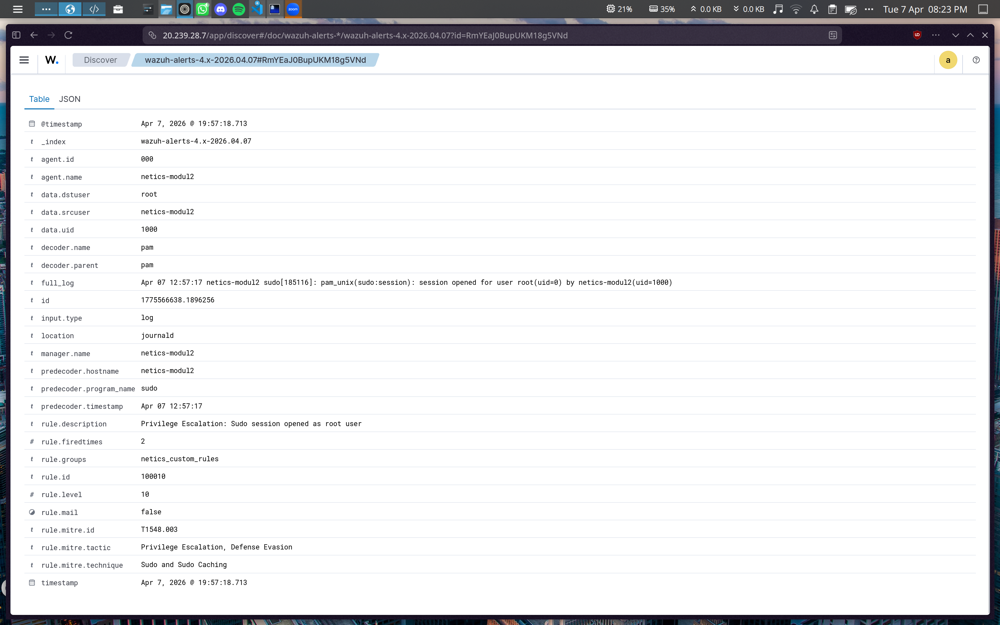

> _Alert level 10 terpicu saat sudo session dibuka sebagai root_

---

### 2. Alert Rule 100011 - Sudo by Trusted Admin (mamahda)

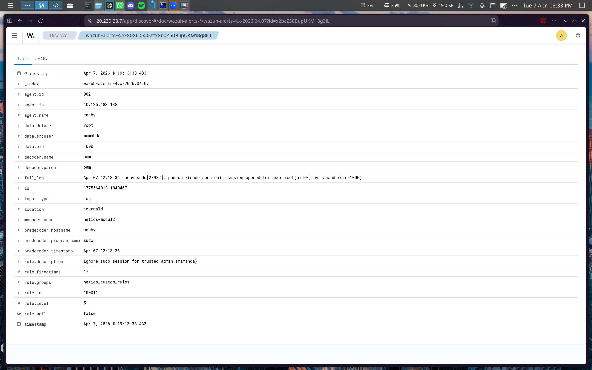

> _Alert level diturunkan ke 5 saat sudo dilakukan oleh user mamahda_

---

### 3. Alert Rule 100020 - Multiple Failed Passwords

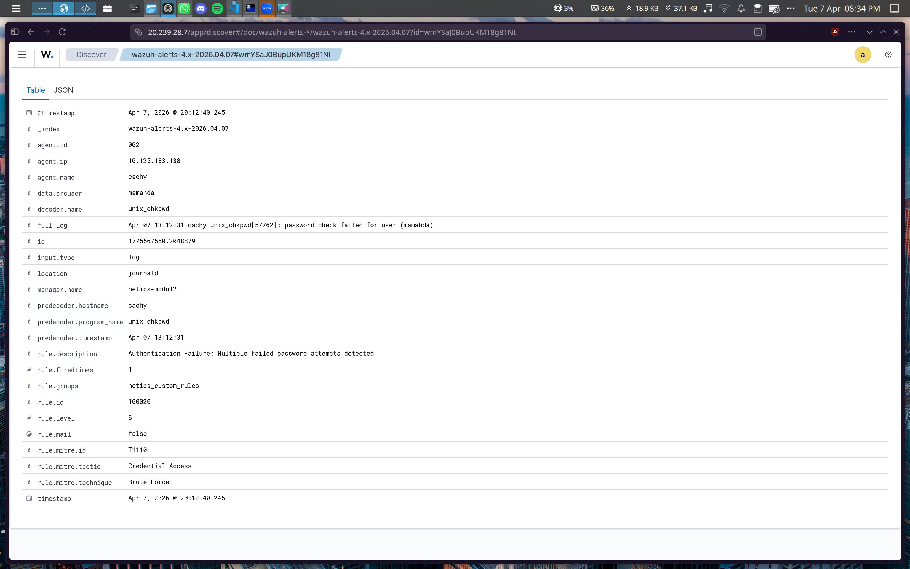

> _Alert terpicu setelah 2 kali gagal login dalam 60 detik_

---

### 4. Alert Rule 100030 - Gamepad Connected

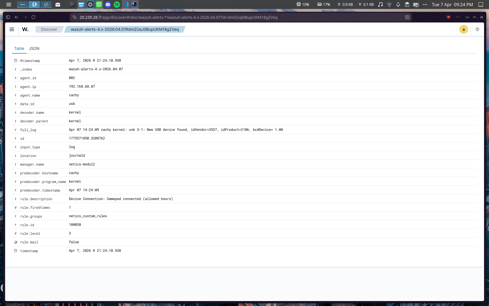

> _Alert level 3 terpicu saat gamepad terhubung ke perangkat_

---

### 5. Alert Rule 100031 - Gamepad Policy Violation

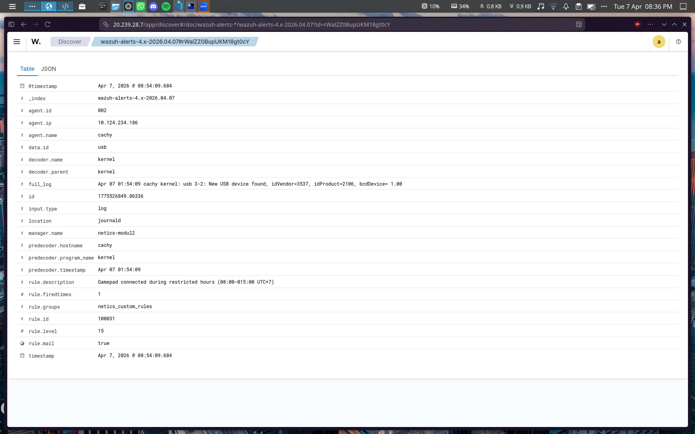

> _Alert level 15 terpicu saat gamepad terhubung pada jam 08:00–15:00 WIB_

---

### 6. Alert Rule 100040 - Camera Access

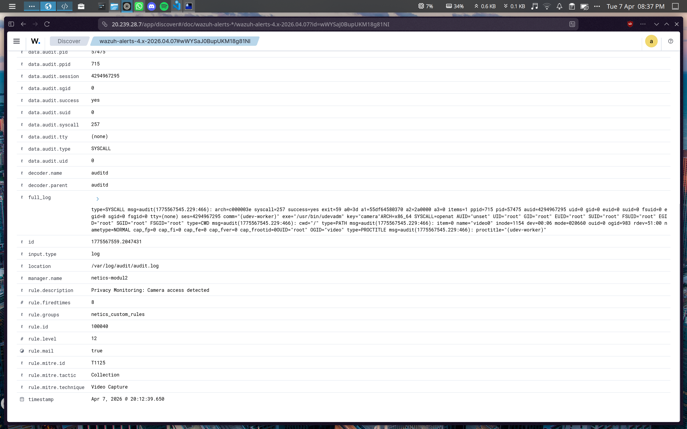

> _Alert level 12 terpicu saat ada proses mengakses /dev/video0_

---

### 7. Alert Rule 100050 - Microphone Access

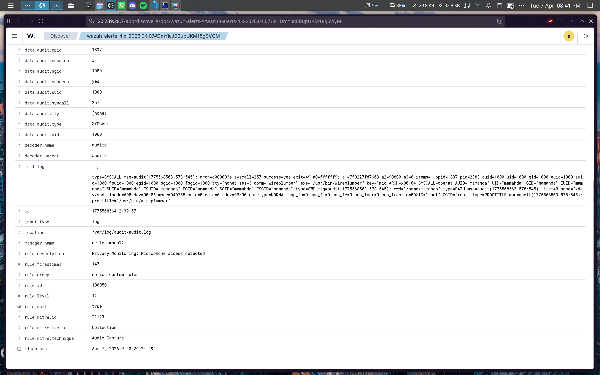

> _Alert level 12 terpicu saat ada akses ke /dev/snd/_

---

### 8. Alert Rule 100060 - FIM Dotfiles Modified

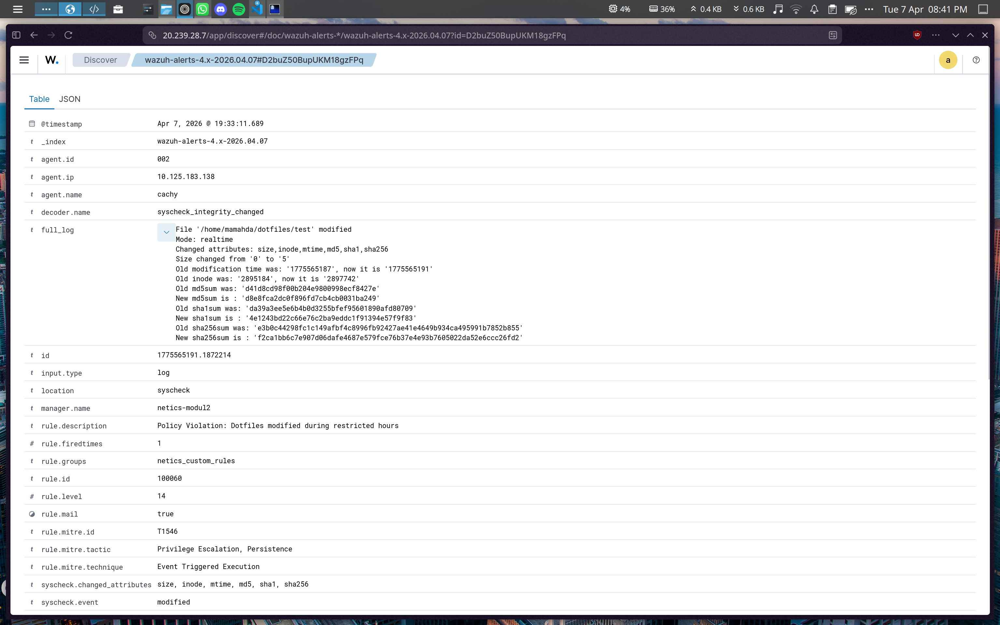

> _Alert FIM terpicu saat dotfiles dimodifikasi pada jam terbatas_

---

### 9. Alert Rule 100070 - FIM Dotfiles Created

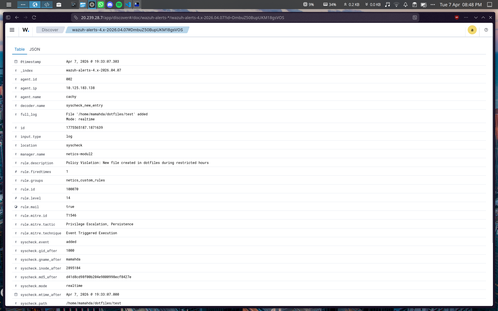

> _Alert FIM terpicu saat file baru dibuat di dalam dotfiles pada jam terbatas_

---

### 10. Alert Rule 100080 - FIM Dotfiles Deleted

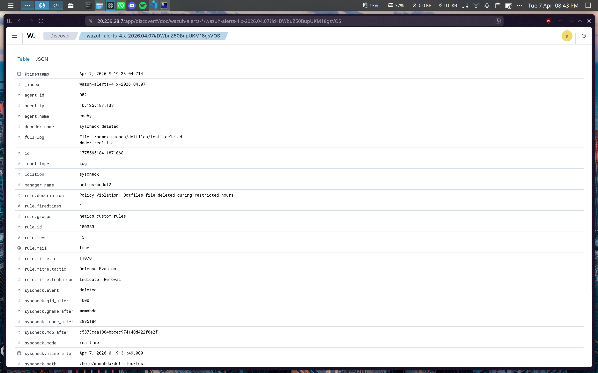

> _Alert FIM terpicu saat dotfiles dihapus pada jam terbatas_

---

## Referensi

| **Judul**                       | **Link**                                                                                                 |
| ------------------------------- | -------------------------------------------------------------------------------------------------------- |
| Instalasi Wazuh                 | [Link](https://youtu.be/6gN0Cc5rsbg?si=F7HyshjVWK16cnyh)                                                 |
| File Integrity Monitoring Wazuh | [Link](https://www.youtube.com/watch?v=78-Fq0iaA2Q)                                                      |
| Wazuh Custom Rules              | [Link](https://medium.com/@fajaryasodana/deploying-wazuh-and-custom-rules-for-log-analysis-ce055ce38beA) |
| Wazuh Manual Documentation      | [Link](https://documentation.wazuh.com/current/user-manual/index.html)                                   |
| MITRE ATT&CK Framework          | [Link](https://attack.mitre.org/)                                                                        |
| Wazuh auditd integration        | [Link](https://documentation.wazuh.com/current/user-manual/capabilities/auditing-whodata/index.html)     |
